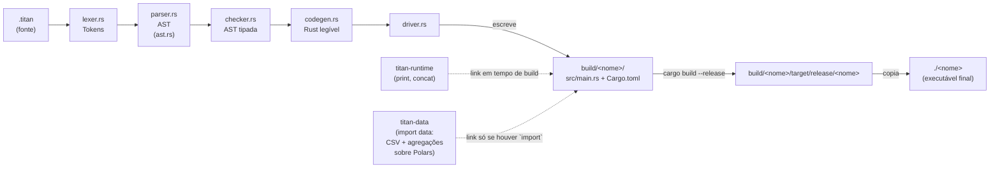

# Arquitetura

## O pipeline

Cada seta é uma função pura de um módulo para o próximo — `lex(&str) ->
Vec<Token>`, `parse(&[Token]) -> Program`, `check(&Program) -> TypedProgram`,
`generate(&TypedProgram) -> String` — orquestradas por `driver::compile`, que é
quem lê o arquivo, grava `build/<nome>/`, invoca o `cargo` como subprocesso e
copia o binário final. `main.rs` só faz parsing de argumentos da CLI e chama
`driver::compile`.

Todo erro em qualquer etapa (léxico, sintático, de tipo, de I/O, ou falha do
próprio `cargo build`) vira uma variante de `Result`/enum de erro com posição
e mensagem em português — nunca um `panic!`. Isso é deliberado: um compilador
que "quebra" ao ver uma construção não suportada é pior que um que recusa com
uma mensagem clara.

## Por que o backend do Titan não foi reaproveitado

O Titan original (`titan/titan-compiler/coder.lua`, 3182 linhas) gera **C**, e
não C portável qualquer: gera C fortemente acoplado à API **interna** do Lua
5.3. Alguns exemplos do acoplamento:

- `String` no Titan vira `TString*` — a struct interna de strings do Lua,
  gerenciada pelo GC do Lua.
- `Array` vira `Table*` — a mesma struct usada para tabelas Lua.
- **Toda** função gerada recebe um `lua_State *L` como parâmetro implícito,
  porque qualquer alocação passa pelo alocador/GC do Lua.

Não existe uma camada intermediária nesse C que separe "a lógica do programa"
de "como o Lua representa valores na memória" — as duas coisas estão
entrelaçadas em cada linha. Trocar o alvo de C-acoplado-ao-Lua para Rust não é
uma tradução mecânica de sintaxe: é escrever um backend inteiro do zero, para
um modelo de memória completamente diferente (ownership/borrow em vez de GC).
Na prática, a fração reaproveitável desse arquivo para um alvo Rust é ~0%.

Some a isso uma barreira prática: o toolchain do Titan (Lua 5.3.5 + LuaRocks)
não está disponível nesta máquina, então nem seria possível iterar sobre o
compilador original mesmo se o backend fosse portável.

**O que *foi* reaproveitado**, então, é o *desenho*, não o código:

| Etapa do Titan (Lua) | Equivalente aqui (Rust) | O que foi herdado |
|---|---|---|
| `lexer.lua` (LPeg) | `lexer.rs` (varredura manual) | conjunto de tokens, regras de literais/comentários |
| `parser.lua` (PEG) | `parser.rs` (descida recursiva) | gramática, precedência, nomes de nó |
| `ast.lua` | `ast.rs` | os mesmos nomes de variante (`ExpString`, `StatCall`, `TopLevelFunc`...) |
| `types.lua` | `types.rs` | as mesmas variantes de tipo e a relação `compatible` (gradual typing) |
| `checker.lua` + `symtab.lua` | `checker.rs` | duas passadas (assinaturas → corpos), pilha de escopos |
| `coder.lua` | `codegen.rs` | **nada do código** — só a ideia de "uma função por variante de nó" |

Manter os mesmos nomes de nó da AST entre os dois projetos é intencional: o
Titan original continua servindo como referência viva sempre que uma dúvida
de comportamento aparece (por exemplo, "o que `checker.lua:1593` faz quando
`main` tem assinatura errada?").

## Modelo de tipos do código gerado

O mapeamento Titan → Rust está isolado em duas funções de
`crates/titanc/src/codegen.rs` (`rust_type_name` e `rust_param_type_name`),
de propósito — desde a Fase 0 essas duas funções foram desenhadas para conter
qualquer troca de modelo de memória sem se espalhar pelo resto do codegen. A
Fase 2 (arrays, maps, records) foi onde essa escolha deixou de poder ser
adiada; o modelo escolhido é **semântica de valor com `clone()`**, sem
`Rc<RefCell<...>>`, sem arena, sem GC — ver
[ADR 0006](adr/0006-semantica-de-valor-clone-na-atribuicao.md).

| Titan | Rust |
|---|---|
| `integer` | `i64` |
| `float` | `f64` |
| `boolean` | `bool` |
| `string` (qualquer posição) | `String` |
| `nil` (retorno) | `()` |
| `{T}` (array) | `Vec<T>` |
| `{K: V}` (map) | `std::collections::HashMap<K, V>` |
| `record Nome` | `struct Nome` própria, `#[derive(Clone, Debug, PartialEq)]` |
| `{string}` (parâmetro de `main`) | `&mut Vec<String>` |
| parâmetro de função de tipo composto | `&mut T` (array/map/record/opaco) |
| tipo opaco de capability (`data.DataFrame`) | caminho Rust do runtime (`titan_data::DataFrame`), `#[derive(Clone)]` obrigatório — [ADR 0013](adr/0013-tipo-opaco-composto-por-heranca.md) |

`print` e `concat` (suporte ao operador `..`) não são geradas pelo compilador
— vêm de `titan-runtime`, um crate Rust comum, referenciado por caminho
absoluto no `Cargo.toml` gerado. O Titan original **não tem `print`**; aqui
ela é stdlib, não palavra-chave. A partir da Fase 2, o `titan-runtime` também
fornece a indexação checada de arrays e maps (`array_get`, `array_get_mut`,
`array_set`, `map_get`) — toda leitura/escrita fora da faixa aborta com
mensagem em português em vez de produzir um valor `T?` como no original (ver
[ADR 0008](adr/0008-indexacao-checada-e-variancia-invariante.md)).

**Cópia vs. referência**, resumido (detalhado nos ADRs 0006–0009):

- `local b = a` com `a` composto → `let b = a.clone();` (cada variável é dona
  da sua cópia).
- `f(a)` com `a` composto → o parâmetro correspondente é `&mut T`; a função
  enxerga e pode mutar o mesmo valor do chamador (preserva o idioma in-place
  de `selection_sort.titan`).
- `string` segue a mesma regra de clone que os demais compostos desde a
  Fase 2 — não há mais distinção entre string "literal" e "computada" no
  codegen ([ADR 0010](adr/0010-string-sempre-string.md)).

## Capability runtimes (`import`, módulos, tipos opacos)

A Fase 3 acrescenta um mecanismo para trazer funcionalidade de um crate Rust
externo ao `titan-runtime` para dentro de um programa Titan, sem exigir FFI
do usuário: `import data` (declaração de topo,
[ADR 0011](adr/0011-import-como-acucar-sintatico.md)) declara `data` como um
módulo — `SymbolKind::Module`, não um `Type`
([ADR 0012](adr/0012-modulo-como-symbolkind-nao-tipo.md)) — cujos membros
(`data.read_csv`, `data.DataFrame`) são resolvidos contra uma tabela de
capabilities (`capabilities.rs`), a fonte única de verdade que o checker, o
codegen e o `driver.rs` consultam para saber, respectivamente, o tipo de
retorno de uma função de módulo, o caminho Rust a emitir, e qual crate
entra como dependência do projeto gerado.

Um tipo exportado por um módulo (`data.DataFrame`) é opaco
(`Type::Opaque`): o programa Titan carrega e passa adiante, mas não
inspeciona os campos. `Opaque` entra no mesmo grupo de `Array`/`Map`/`Record`
em `is_composite` — herda `&mut` em parâmetro de função e receptor de método
sem exigir código novo no checker, ao custo de exigir `Clone` de todo tipo
de runtime usado dessa forma
([ADR 0013](adr/0013-tipo-opaco-composto-por-heranca.md)). Método é sempre
chamado com `.`, nunca `:` — `df.soma("valor")` é açúcar de
`data.soma(df, "valor")`, resolvido pelo checker ao ver que a base tem
`Type::Opaque`
([ADR 0014](adr/0014-metodo-com-ponto-nao-dois-pontos.md)).

`titan-data` é a primeira capability implementada sobre esse mecanismo:
leitura de CSV e agregações sobre Polars, com a ressalva de que Polars é
**detalhe interno** — o programa Titan só enxerga a API `data.*`, nunca um
tipo do crate `polars` diretamente
([ADR 0015](adr/0015-api-data-como-contrato-backend-trocavel.md)). Isso tem
um custo mensurável: um programa com `import data` leva **~2min de build** e
deixa **~3GB** em `build/<nome>/target/`, porque o `titanc` gera um projeto
Cargo por programa. `collect_deps` (`driver.rs`) só inclui `titan-data` nas
dependências do `Cargo.toml` gerado quando o programa de fato importa
`data` — o `Cargo.toml` gerado não tem mais uma lista fixa de dependências;
é montado por módulo importado, e um programa sem `import` nunca paga esse
custo.

## Duas armadilhas do Cargo (por que `driver.rs` faz o que faz)

1. O `Cargo.toml` gerado em `build/<nome>/` leva um `[workspace]` **vazio**.
   Sem isso, o `cargo` tenta anexar esse diretório ao workspace pai
   (`titan-rust/Cargo.toml`) e a build quebra.
2. `titan-runtime` é referenciado por **caminho absoluto** no `Cargo.toml`
   gerado — sem rede, sem registry. O projeto gerado em `build/<nome>/` não é
   parte do workspace do compilador, então um caminho relativo dependeria de
   onde `--out` aponta.
